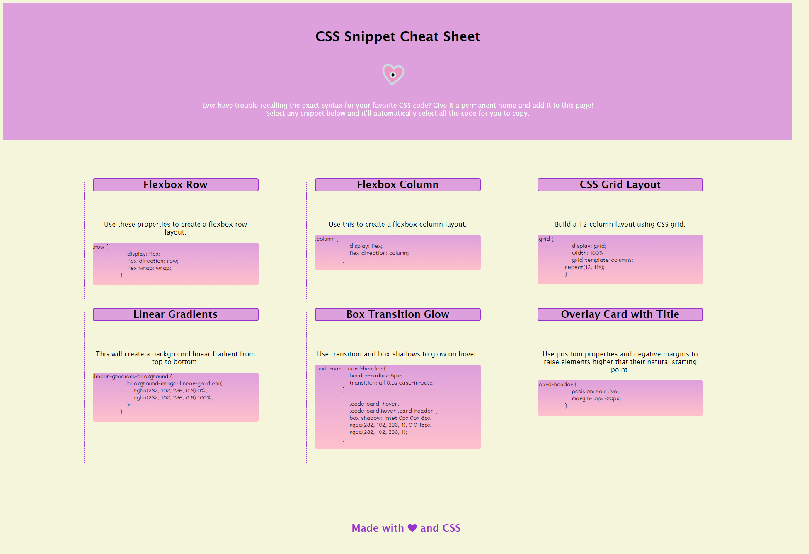

# CSS Snippet Cheat Sheet

## Description

Building responsive websites is a crucial skill for any developer, but it can be very daunting. This CSS Snippet Cheat Sheet is a website built using responsive web design that shows helpful code snippets used in it's creation. These snippets can be a great starting point when building a website that will create a great experience for all types of end users. The cards will wrap and display in columns or rows based off of screen size. In creating this project, I learned how to build a clean, semantic, responsive web desgin from scratch.

## Installation

N/A

## Usage

New or current developers can refer to this cheat sheet to find helpful code snippets to use in responsive web design. The code snippets can be copied and pasted into an existing project and customized to suit your needs. This can also be used as a study guide to brush up on Flexbox topics and CSS rules that are commonly used in responsive websites. The inspect tool can be used to view elements and see how they are layed out within the webpage. Access the Devtools console by pressing Command+Option+I (macOS) or Control+Shift+I (Windows).

## Credits

N/A

## License

MIT License Copyright (c) 2022 VisualViolet

Please refer to the license in the repo.

